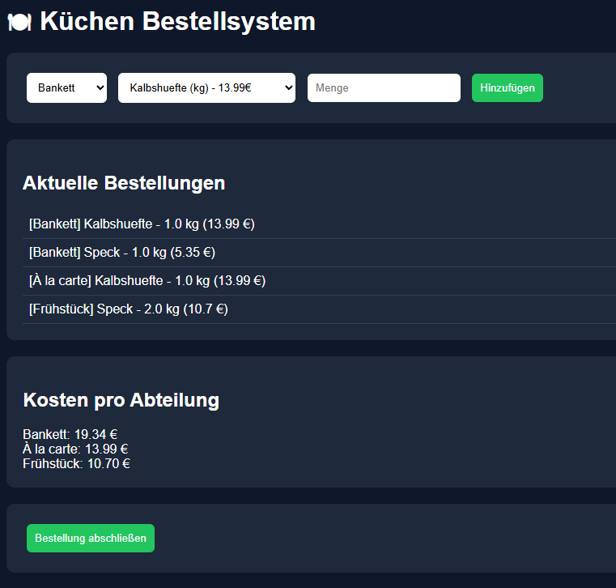

# 🍽 Küchen Bestellsystem (Flask) v0.1

Webbasiertes Bestellsystem zur strukturierten Erfassung, Bündelung und Auswertung von Küchenbestellungen über mehrere Abteilungen.

---

## 📌 Projektziel

In professionellen Küchen werden Bestellungen häufig manuell und unübersichtlich durchgeführt.

Dieses System digitalisiert den Prozess durch:
- zentrale Bestellerfassung
- automatische Bündelung nach Lieferanten
- transparente Kostenverteilung pro Abteilung

---

## ⚙️ Funktionen

- Bestellungen nach Abteilungen (Bankett, à la carte, Frühstück)
- Produktverwaltung mit Lieferantenzuordnung
- Automatische Bündelung der Bestellungen pro Lieferant
- Kostenberechnung pro Abteilung
- PDF-Export pro Lieferant
- SQLite Datenbank

---

## 🧰 Tech Stack

- Python 3
- Flask
- Flask-SQLAlchemy
- SQLAlchemy
- Jinja2 Templates
- ReportLab (PDF-Generierung)
- SQLite

---

## Screenshot



---

## 📁 Projektstruktur

```text
bestellsystem/
│
├── app/
│   ├── __init__.py
│   ├── models.py
│   ├── routes.py
│
├── templates/
│   ├── index.html
│   ├── supplier_orders.html
│
├── run.py
├── import_products.py
├── requirements.txt
└── README.md
